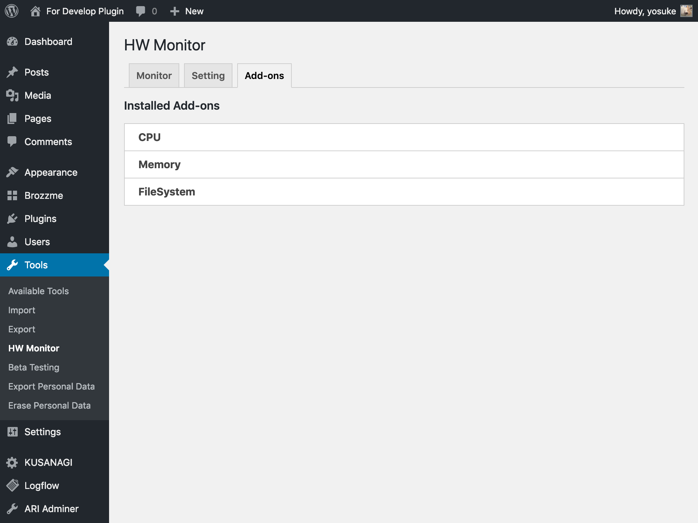

# HW Monitor

Displays performance monitor, such as the Microsoft Windows Task Manager on WordPress.
The link is made to "Admin menu" > "Tools" > "HM Monitor".

### Caution:
This plugin works only in Linux environment.

## Installation 

1. Upload the plugin package to the plugins directory.
2. Login to the dashboard and activate the plugin.
3. Use shortcode `[hw]` in page to show on front page.
4. Add the widget in sidebar in apparence option.

## Screenshots

== Changelog ==
= 1.1.3 =
* Tested on 5.2.
* Refactoring.
* Update modules.

= 1.1.2 =
* Tested on 5.1.
* Update libraries.

= 1.1.1 =
* Bugfix: Fix to prevent add-on tab warning.

= 1.1.0 =
* Add add-on tab
  * Display installed add-ons, and if an error occurred it will display its details.

= 1.0.3 =
* Tested on 5.0.

= 1.0.2 =
* Bugfix: php shortcode.

= 1.0.1 =
* Update library.

= 1.0.0 =
first version.
