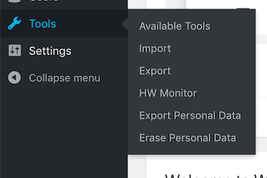
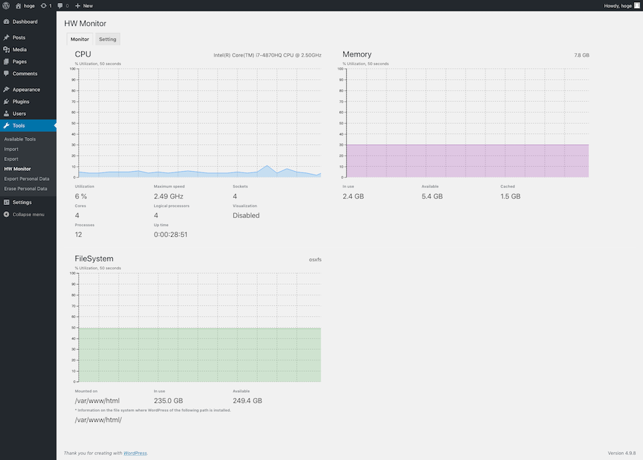
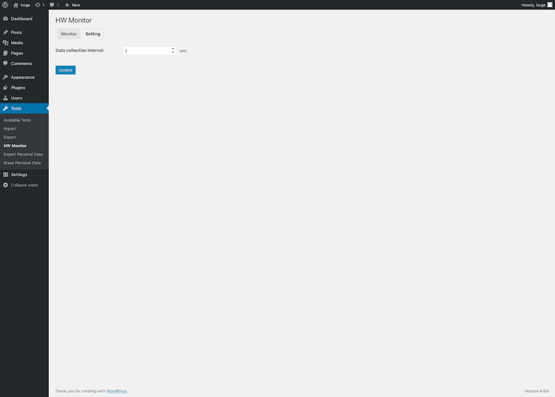

# HW Monitor

Displays performance monitor, such as the Microsoft Windows Task Manager on WordPress.
The link is made to "Admin menu" > "Tools" > "HM Monitor".

### Caution:
This plugin works only in Linux environment.

## Installation 

1. Upload the plugin package to the plugins directory.
2. Login to the dashboard and activate the plugin.

## Screenshots

